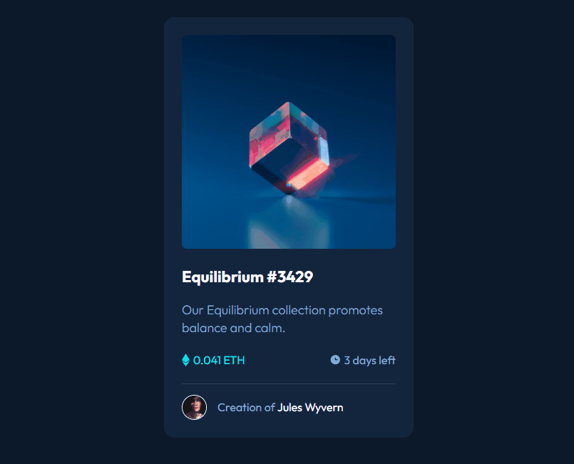

# Projeto de NFT Preview Card
Um Projeto visual de um card de NFT.

[]

## Linguagens Utilizadas 💻
- HTML; 💻
- CSS; 🎨

## Desafios e Objetivos 🚀
Colocar em prática ensinamentos sobre HTML e CSS.

### Autor 🧑🏻
Rafael Cardoso dos Santos
